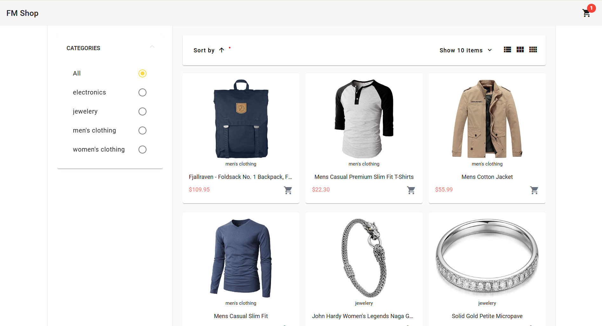
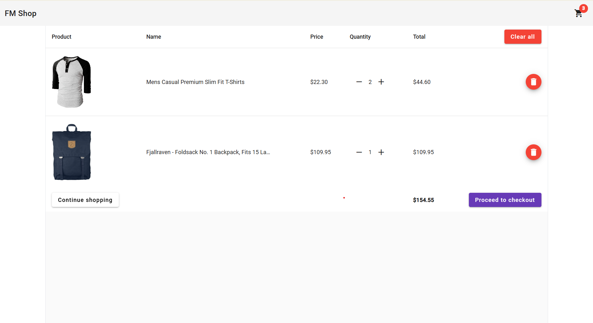
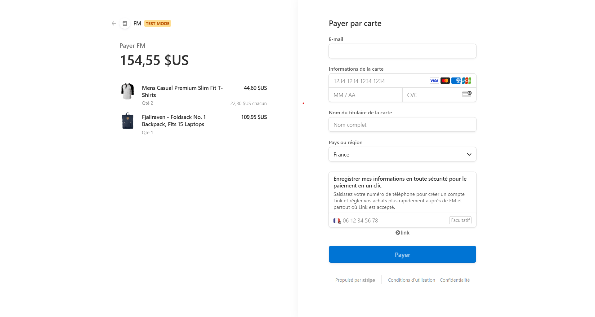

# An E-commerce website build with Angular

# Description

This project has been build in learning purpose. It is suppose to cover must of the basic knowledge in Angular with a first deal with **Stripe** the famous online payment API.

# Tools 

To build this, I used:
- Angular material 
- Tailwind css
- Express and Stripe for the checkout server

# Requirements

To run the app you'll need: 
- Node js
- Angular CLI 
- Some knowledge with Typescript 

> **NB:** You would need to update the `publicKey` variable in the `./src/app/services/cart.service.ts` futhermore, you need to add a `.env` file in the `server` folder with your should update the `.env.template` file in server folder with your stripe private key and rename it to `.env`

# Screen short 

  
  
  

